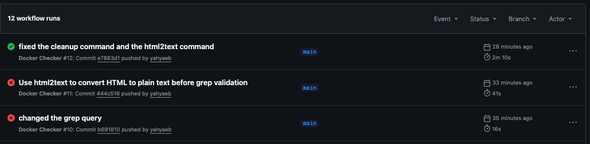

# CI/CD Pipeline Demo

This project demonstrates a simple **CI/CD pipeline** using GitHub Actions and Docker.  
It builds and runs my **portfolio’s `index.html`** inside an **Nginx container**, then performs automated tests to ensure the site is up and serving content correctly.

---

## Why CI/CD?

Continuous Integration and Continuous Deployment (CI/CD) provide major advantages for any development workflow:

- Automatically tests code on each push  
- Reduces risk of manual errors during deployment  
- Saves time by automating repetitive tasks  
- Ensures consistent and reliable builds  

---

## How It Works (GitHub Actions)

The workflow is defined in a YAML file located in  
`.github/workflows/smoke_test.yml`.

GitHub Actions uses **YAML**, a human-readable configuration language widely used by DevOps engineers.  
Each workflow can range from a simple automation script to a complex multi-stage deployment.

Here’s what my pipeline does:

1. **Trigger:** Runs automatically on each push to the `main` branch.  
2. **Job:** `check_docker` — executed on an `ubuntu-latest` runner.  
3. **Steps:**  
   - Checkout repository  
   - Build a Docker image from the project’s `Dockerfile`  
   - Run an Nginx container  
   - Perform a **smoke test** using `curl`  
   - Validate the served HTML content with `html2text` and `grep`  
   - Clean up the container after the test  

### `run:` vs `uses:`
- **`run:`** → Executes custom shell commands  
- **`uses:`** → Calls prebuilt GitHub Actions (e.g., `actions/checkout@v4`)

---

## Smoke Test & Debugging

A **smoke test** ensures the Docker container runs and responds correctly.  
During development, I intentionally used an incorrect port to verify the test failure.  
I also discovered an issue where `grep` couldn’t find text directly inside HTML output.  

To fix this, I installed **`html2text`** to convert the HTML response to plain text before validating it with `grep`.  
This improved reliability and allowed the CI/CD test to pass successfully.

---

## Status Badge

The build status badge (shown above) updates automatically —  
✅ Green for success and ❌ red for failure — making it easy to monitor the pipeline’s health at a glance.

---

## Resources

- [GitHub Actions Documentation](https://docs.github.com/en/actions)  
- [How to Write Your Own GitHub Action – Towards Data Science](https://towardsdatascience.com/how-to-write-your-own-github-action-59cc4746a57a/)  
- [Video Guide on GitHub Actions](https://www.youtube.com/watch?v=mFFXuXjVgkU)

---

**Author:** Yahia Elboukili  
**Project Goal:** Demonstrate hands-on understanding of CI/CD concepts using Docker and GitHub Actions.
